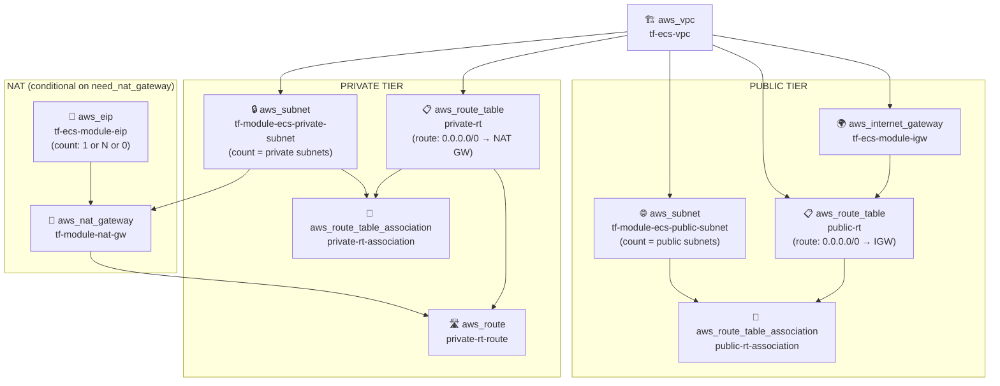

# AWS Network Resources - Dependency Diagram

## Resource Summary

| Resource | Count | Purpose |
|---|---|---|
| `aws_vpc` | 1 | Root network container |
| `aws_subnet` (public) | N | Public-facing subnets |
| `aws_internet_gateway` | 1 | Outbound internet for public subnets |
| `aws_route_table` (public) | 1 | Routes public traffic → IGW |
| `aws_route_table_association` (public) | N | Links each public subnet to public RT |
| `aws_subnet` (private) | N | Internal subnets (no direct internet) |
| `aws_eip` | 0–N | Static IP(s) for NAT gateway |
| `aws_nat_gateway` | 0–N | Outbound internet for private subnets |
| `aws_route_table` (private) | 1 | Routes private traffic → NAT GW |
| `aws_route` (private) | 1 | Default route entry in private RT |
| `aws_route_table_association` (private) | N | Links each private subnet to private RT |
